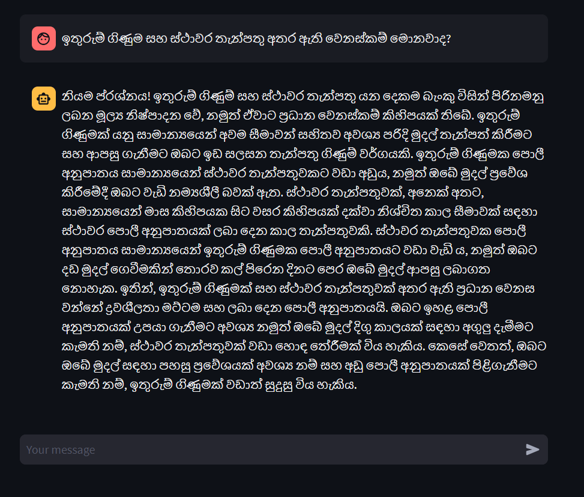

# Localized Chatbot for Banking domain

The Localized Chatbot for Bank Customer Care project aims to develop an intelligent and interactive chatbot system to enhance customer support services for users who communicate in the native Sri Lankan (Sinhala or Tamil) language. This innovative chatbot will serve as a virtual assistant, providing quick and efficient assistance to customers seeking information regarding various banking services, account-related queries, and general inquiries.

- Language Adaptability: The primary objective of this project is to build a chatbot that can seamlessly understand and respond in either Sinhala or Tamil language. By ensuring linguistic fluency, the chatbot will enable users to interact comfortably and receive accurate and contextually appropriate responses.

- Automated Customer Support: The chatbot will act as a virtual customer support representative, automating responses to frequently asked questions and routine inquiries. By leveraging natural language processing (NLP) techniques, the chatbot will provide instant and accurate information on topics such as account balances, transaction history, loan applications, card services, and other common banking processes.

- Personalization and Context Awareness: To enhance customer satisfaction, the chatbot will be designed to recognize returning customers and retrieve their historical data. This will enable personalized assistance based on individual preferences and past interactions, creating a more personalized and engaging customer experience.

- Security and Compliance: Data security and privacy will be of paramount importance. The chatbot will be developed with robust encryption protocols to protect customer information and adhere to banking regulations and privacy laws.

- 24/7 Service:This chatbot is capable of providing 24 hour service and reduces workload for the bank staff. This will enable customers to interact with the bank even when the bank staff are not available.

## Get Started

### Prerequisites

Python <br>
Anaconda <br>
Firebase account

### Installation

create a new conda environment with python version 3.8

```bash
conda create -n chatbot python=3.8
```

Activate the conda environment

```bash
conda activate chatbot
```

Install the requirements.txt file using the following command.

```bash
pip install -r requirements.txt
```

### Set up Firebase

Create a new project in firebase and add a new app to the project. <br>
Enable the authentication and realtime database services. <br>
Download the service account key and save it in the BackEnd/FireBaseDB/service_account_key.json <br>
Download the config file and save it in the BackEnd/FireBaseDB/firebase_config.json <br>

### Set up Google Translate

- Set up a google cloud project
- Enable the Google Translate API
- Create a service account and download the service account key
- Login with the service account in the google cloud console
- Copy the project id put in the BackEnd/GoogleTranslate/google_translator.py

### Set up Language Model

- Get the replicate api token [here](https://replicate.com/account/api-tokens)
- Create a file named, 'configure.py' in the BackEnd/LLM folder.

### Set up VectorDB

- Go to VectorDB folder
- Run the following command to create the vector database

```bash
python vec_db.py
```

## Usage

Login details for the chatbot

Email:

```bash
sada@gmail.com
```

<br>

Password:

```bash
 123456
```

<br>

Replicate API TOKEN:

```bash
r8_....
```

Open a command prompt

```bash
cd BackEnd\IntentClassifierRasa\
```

```bash
rasa train
```

Get the model's name from the output 

Run the following command to start the Rasa server for the chatbot.

```bash
rasa run --enable-api -m models/name_of_the_model
```

Open a new command prompt and run the following command to start the action server.

```bash
cd BackEnd
```

```bash
uvicorn --port 1234 main:app --reload
```

## Features

- Can be used in Sinhala or Tamil or English.
- Connected to real time database. Users can ask questions about their account details.
- Users can ask questions about the bank services. The static data (i.e Data which does not change with time. Eg. Bank account opening procedures, loan procedures, bank history etc.) is stored in the vector database.
- Chatbot is restricted to the banking domain. It will not answer questions which are not related to banking.
  (Sometimes, the LLM might hallucinate and answer questions which are not related to banking. We are working on it)

## Screenshots of Streamlit Application

### English


<table align="center">
  <tr>
    <td align="center">
     <h1 style="text-align:center;">Sinhala</h1>
           
    </td>
    <td align="center">
      <h1 style="text-align:center;">Tamil</h1>
      
    </td>
  </tr>
</table>

## Group Members

- Sanujen Premkumar(200583P)
- Joel Sathiyendra Thiyaheswaran(200590J)
- Sandaruth Siriwardana(200607V)
